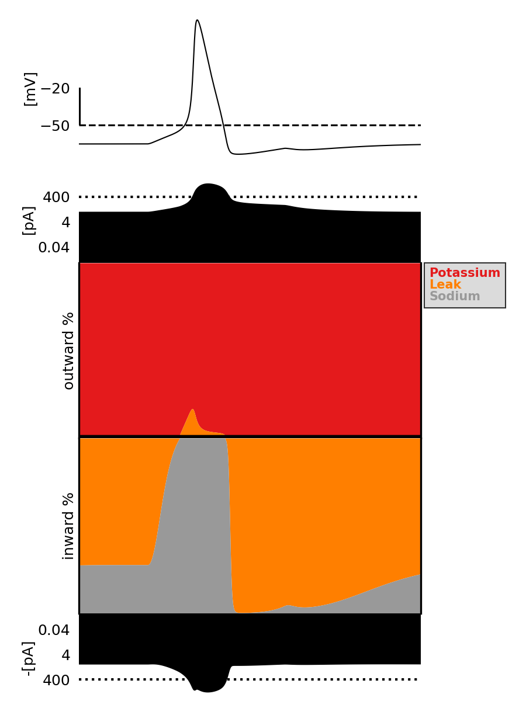

Currentscape
============

+----------------+------------+
| Latest Release | |pypi|     |
+----------------+------------+
| Documentation  | |docs|     |
+----------------+------------+
| License        | |license|  |
+----------------+------------+
| Build Status 	 | |build|    |
+----------------+------------+
| Coverage       | |coverage| |
+----------------+------------+
| Gitter         | |gitter|   |
+----------------+------------+
| Citation       | |zenodo|   |
+----------------+------------+

Introduction
============

Currentscape is a Python tool enabling scientists to easily plot the currents in electrical neuron models.
The code is based on the paper `Alonso and Marder, 2019 <https://doi.org/10.7554/eLife.42722>`__.

Currentscape figures plot the percentage of inward and outward ionic membrane currents,
the total inward and outward currents, as well as the voltage in function of time.
It allows modellers to see which currents play a role at any given time during a simulation, and check in depth the current dynamics.

.. image:: doc/source/images/plot.png

Citation
========

When you use this Currentscape software for your research, we ask you to cite the following publications (this includes poster presentations):

.. code-block:: 

    @article {10.7554/eLife.42722,
        article_type = {journal},
        title = {Visualization of currents in neural models with similar behavior and different conductance densities},
        author = {Alonso, Leandro M and Marder, Eve},
        editor = {Westbrook, Gary L and Skinner, Frances K and Lankarany, Milad and Britton, Oliver},
        volume = 8,
        year = 2019,
        month = {jan},
        pub_date = {2019-01-31},
        pages = {e42722},
        citation = {eLife 2019;8:e42722},
        doi = {10.7554/eLife.42722},
        url = {https://doi.org/10.7554/eLife.42722},
        abstract = {Conductance-based models of neural activity produce large amounts of data that can be hard to visualize and interpret. We introduce visualization methods to display the dynamics of the ionic currents and to display the models’ response to perturbations. To visualize the currents’ dynamics, we compute the percent contribution of each current and display them over time using stacked-area plots. The waveform of the membrane potential and the contribution of each current change as the models are perturbed. To represent these changes over a range of the perturbation control parameter, we compute and display the distributions of these waveforms. We illustrate these procedures in six examples of bursting model neurons with similar activity but that differ as much as threefold in their conductance densities. These visualization methods provide heuristic insight into why individual neurons or networks with similar behavior can respond widely differently to perturbations.},
        keywords = {neuronal oscillators, Na+ channels, Ca++ channels, K+ channels, conductance-based, ionic channels},
        journal = {eLife},
        issn = {2050-084X},
        publisher = {eLife Sciences Publications, Ltd},
    }
    
    @article{currentscape, 
        title={Currentscape}, 
        DOI={10.5281/zenodo.8046373}, 
        abstractNote={Currentscape is a Python tool enabling scientists to easily plot the currents in electrical neuron models. The code is based on the paper Alonso and Marder, 2019. Currentscape figures plot the percentage of inward and outward ionic membrane currents, the total inward and outward currents, as well as the voltage in function of time. It allows modellers to see which currents play a role at any given time during a simulation, and check in depth the current dynamics.}, 
        publisher={Zenodo}, 
        author={Jaquier, Aurélien and Tuncel, Anil and Van Geit, Werner and Alonso, Leandro M and Marder, Eve}, 
        year={2023}, 
        month={Jun} 
    }

Support
=======

We are providing support on `Gitter <https://gitter.im/BlueBrain/Currentscape>`_. We suggest you create tickets on the `Github issue tracker <https://github.com/BlueBrain/Currentscape/issues>`_ in case you encounter problems while using the software or if you have some suggestions.

Main dependencies
=================

- `Python 3.8+ <https://www.python.org/downloads/release/python-380/>`_
- `Numpy <https://numpy.org/>`_ (automatically installed by pip)
- `Palettable <https://github.com/jiffyclub/palettable>`_ (automatically installed by pip)

Installation
============

Currentscape can be pip installed with the following command:

.. code-block:: python

    pip install currentscape

If you want to be able to run the Currentscape examples, you will need to also install the example dependencies:

.. code-block:: python

    pip install currentscape[example]

Quick Start
===========

Below is an example of a ball and stick model in NEURON with simple Hodgkin-Huxley mechanisms, to which a step stimulus is applied.

The voltage and ionic currents are recorded and fed to Currentscape, along with a configuration dictionary containing the current names to be displayed in the legend.

To run the code you will first have to install NEURON package:

.. code-block:: python

    pip install neuron

When you then execute the following python code, a window should open with the currentscape plot:

.. literalinclude:: doc/source/examples/quickstart/quickstart.py
   :language: python

When you run this code in Python, it will generate the following currentscape plot (in a window, and on disk as quickstart_plot.png):

Tutorial
========

A more detailed explanation on how to use Currentscape, as well as other examples can be found on the `tutorial page <Tutorial.rst>`_.

API Documentation
=================

The API documentation can be found on `ReadTheDocs <https://currentscape.readthedocs.io>`_.

Funding & Acknowledgements
==========================

We wish to thank the authors of `Alonso and Marder, 2019 <https://doi.org/10.7554/eLife.42722>`__ to let us integrate a part of their `code <https://datadryad.org/stash/dataset/doi:10.5061/dryad.d0779mb>`_ into this repository.

The part of the code in this repository developed by the EPFL Blue Brain Project was supported by funding to the Blue Brain Project, a research center of the École polytechnique fédérale de Lausanne (EPFL), from the Swiss government's ETH Board of the Swiss Federal Institutes of Technology.

.. |pypi| image:: https://img.shields.io/pypi/v/currentscape.svg
               :target: https://pypi.org/project/currentscape/
               :alt: latest release

.. |docs| image:: https://readthedocs.org/projects/currentscape/badge/?version=latest
               :target: https://currentscape.readthedocs.io/
               :alt: latest documentation

.. |license| image:: https://img.shields.io/pypi/l/currentscape.svg
                  :target: https://github.com/BlueBrain/Currentscape/blob/main/LICENSE.txt
                  :alt: license

.. |build| image:: https://github.com/BlueBrain/Currentscape/workflows/Test/badge.svg?branch=main
                :target: https://github.com/BlueBrain/Currentscape/actions
                :alt: actions build status

.. |coverage| image:: https://codecov.io/github/BlueBrain/Currentscape/coverage.svg?branch=main
                   :target: https://codecov.io/gh/BlueBrain/currentscape
                   :alt: coverage

.. |gitter| image:: https://badges.gitter.im/Join%20Chat.svg
                 :target: https://gitter.im/BlueBrain/Currentscape
                 :alt: Join the chat at https://gitter.im/BlueBrain/Currentscape

.. |zenodo| image:: https://zenodo.org/badge/DOI/10.5281/zenodo.8046484.svg
                :target: https://doi.org/10.5281/zenodo.8046373
