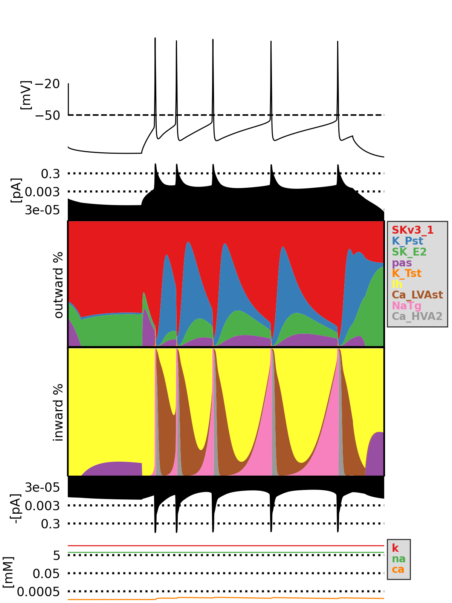

Currentscape
============

.. raw:: html

	<table>
	<tr>
	  <td>Latest Release</td>
	  <td>
	    
	  </td>
	</tr>
	<tr>
	  <td>Documentation</td>
	  <td>
	    
	  </td>
	</tr>
	<tr>
	  <td>License</td>
	  <td>
	    
	</td>
	</tr>
	<tr>
	  <td>Build Status</td>
	  <td>
	    
	  </td>
	</tr>
	<tr>
	  <td>Coverage</td>
	  <td>
	    
	  </td>
	</tr>
	<tr>
		<td>Gitter</td>
		<td>
			<a href="https://gitter.im/bluebrain/currentscape">
			
		</td>
	</tr>
	</table>

Introduction
============

Currentscape is a Python tool enabling scientists to easily plot the currents in electrical neuron models.
The code is based on the paper `Alonso and Marder, 2019 <https://doi.org/10.7554/eLife.42722>`_.

Currentscape figures plot the percentage of inward and outward ionic membrane currents,
the total inward and outward currents, as well as the voltage in function of time.
It allows the modellers to see which currents play a role at any given time, and check in depth the currents dynamics.

Citation
========

When you use this Currentscape software for your research, we ask you to cite the following publication (this includes poster presentations):

.. code-block:: 

    @article {10.7554/eLife.42722,
    article_type = {journal},
    title = {Visualization of currents in neural models with similar behavior and different conductance densities},
    author = {Alonso, Leandro M and Marder, Eve},
    editor = {Westbrook, Gary L and Skinner, Frances K and Lankarany, Milad and Britton, Oliver},
    volume = 8,
    year = 2019,
    month = {jan},
    pub_date = {2019-01-31},
    pages = {e42722},
    citation = {eLife 2019;8:e42722},
    doi = {10.7554/eLife.42722},
    url = {https://doi.org/10.7554/eLife.42722},
    abstract = {Conductance-based models of neural activity produce large amounts of data that can be hard to visualize and interpret. We introduce visualization methods to display the dynamics of the ionic currents and to display the models’ response to perturbations. To visualize the currents’ dynamics, we compute the percent contribution of each current and display them over time using stacked-area plots. The waveform of the membrane potential and the contribution of each current change as the models are perturbed. To represent these changes over a range of the perturbation control parameter, we compute and display the distributions of these waveforms. We illustrate these procedures in six examples of bursting model neurons with similar activity but that differ as much as threefold in their conductance densities. These visualization methods provide heuristic insight into why individual neurons or networks with similar behavior can respond widely differently to perturbations.},
    keywords = {neuronal oscillators, Na+ channels, Ca++ channels, K+ channels, conductance-based, ionic channels},
    journal = {eLife},
    issn = {2050-084X},
    publisher = {eLife Sciences Publications, Ltd},
    }

Support
=======

We are providing support on `Gitter <https://gitter.im/BlueBrain/Currentscape>`_. We suggest you create tickets on the `Github issue tracker <https://github.com/BlueBrain/Currentscape/issues>`_ for suggestions, or problems you encounter while using the software.

Main dependencies
=================

- `Python 3.7+ <https://www.python.org/downloads/release/python-370/>`_
- `Numpy <https://numpy.org/> (automatically installed by pip)>`_
- `Palettable <https://github.com/jiffyclub/palettable>`_ (automatically installed by pip)

Installation
============

Currentscape can be pip installed with the following command:

.. code-block:: python

    pip install currentscape

If you want to be able to run the Currentscape examples, you will need to also install the example dependencies:

.. code-block:: python

    pip install currentscape[example]

Quick Start
===========

Below is an example of a ball and stick model in NEURON with simple Hodgkin-Huxley mechanisms, to which a step stimulus is applied.

The voltage and ionic currents are recorded and fed to Currentscape, along with a configuration dictionary containing the current names to be displayed in the legend.

To run the code you will first have to install neuron:

.. code-block:: python

    pip install currentscape[example]

When you then execute the following python code, a window should pop up with the currentscape plot:

.. code-block:: python

    import numpy as np
    from neuron import h
    from neuron.units import ms, mV
    from currentscape.currentscape import plot_currentscape

    h.load_file('stdrun.hoc')

    soma = h.Section(name='soma')
    dend = h.Section(name='dend')

    dend.connect(soma(1))

    soma.L = soma.diam = 12.6157
    dend.L = 200
    dend.diam = 1

    for sec in h.allsec():
        sec.Ra = 100    # Axial resistance in Ohm * cm
        sec.cm = 1      # Membrane capacitance in micro Farads / cm^2

    # Insert active Hodgkin-Huxley current in the soma
    soma.insert('hh')
    for seg in soma:
        seg.hh.gnabar = 0.12  # Sodium conductance in S/cm2
        seg.hh.gkbar = 0.036  # Potassium conductance in S/cm2
        seg.hh.gl = 0.0003    # Leak conductance in S/cm2
        seg.hh.el = -54.3     # Reversal potential in mV

    # Insert passive current in the dendrite
    dend.insert('pas')
    for seg in dend:
        seg.pas.g = 0.001  # Passive conductance in S/cm2
        seg.pas.e = -65    # Leak reversal potential mV

    stim = h.IClamp(dend(1))
    stim.delay = 5
    stim.dur = 10
    stim.amp = 0.1

    current_names = ["ik", "ina", "il_hh"]
    t_vec = h.Vector()
    v_vec = h.Vector()
    ik_vec = h.Vector()
    ina_vec = h.Vector()
    il_vec = h.Vector()
    t_vec.record(h._ref_t)
    v_vec.record(soma(0.5)._ref_v)
    ik_vec.record(soma(0.5)._ref_ik)
    ina_vec.record(soma(0.5)._ref_ina)
    il_vec.record(soma(0.5)._ref_il_hh)

    h.finitialize(-65 * mV)
    h.continuerun(25 * ms)

    to_pA = 10 * soma(0.5).area() # turn mA/cm2 (*um2) into pA
    voltage = np.asarray(v_vec)
    potassium = np.asarray(ik_vec) * to_pA
    sodium = np.asarray(ina_vec) * to_pA
    leak = np.asarray(il_vec) * to_pA

    config = {
        "current": {"names": current_names},
        "voltage": {"ylim": [-90, 50]},
        "legendtextsize": 5,
    }
    fig = plot_currentscape(voltage, [potassium, sodium, leak], config)
    fig.show()

The current and voltage vector should have the same length. The current names in the config should be in the same order as the current list given to the plot_currentscape function.

More detailed explanations on how to use the Currentscape module, as well as other examples can be found in `Tutorial.rst`.

API Documentation
=================

The API documentation can be found on `ReadTheDocs <"https://currentscape.readthedocs.io">`_.

Funding & Acknowledgements
==========================

We wish to thank the authors of `Alonso and Marder, 2019 <https://doi.org/10.7554/eLife.42722>`_ to let us integrate a part of their `code <https://datadryad.org/stash/dataset/doi:10.5061/dryad.d0779mb>`_ into this repository.

The part of the code in this repository developed by the EPFL Blue Brain Project was supported by funding to the Blue Brain Project, a research center of the École polytechnique fédérale de Lausanne (EPFL), from the Swiss government's ETH Board of the Swiss Federal Institutes of Technology.
